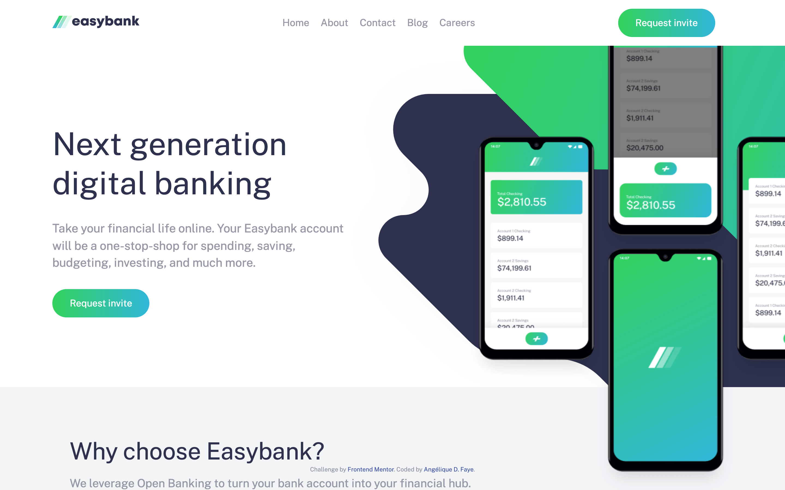

# Easybank landing page

## Overview

_A landing page for a digital banking service._

 

## Links

<a href="https://github.com/AngeliqueDF/easybank-landing-page">GitHub repository</a> • <a href="https://dainty-biscochitos-f69ac4.netlify.app/">Live demo </a>

 

## How to run the project

1. `git clone https://github.com/AngeliqueDF/easybank-landing-page.git MY_FOLDER_NAME`
2. `cd MY_FOLDER_NAME`
3. `npm install`
4. `npm start`
5. visit `http://localhost:3000`

 

## Features

- Accessible.
- Responsive.
- Overflowing hero section.
- Interactive mobile menu.

## Technologies

- HTML.
- CSS.
- JavaScript.

 

## Status

### Planned changes

- [ ] Refactor the JavaScript code.

## Author

- [@AngeliqueDF on GitHub.](https://github.com/AngeliqueDF)
- [Visit my website.](https://adf.dev)
- [View my Frontend Mentor profile.](https://www.frontendmentor.io/profile/AngeliqueDF)
